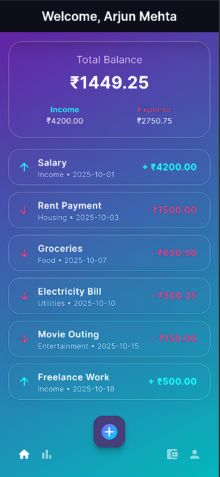
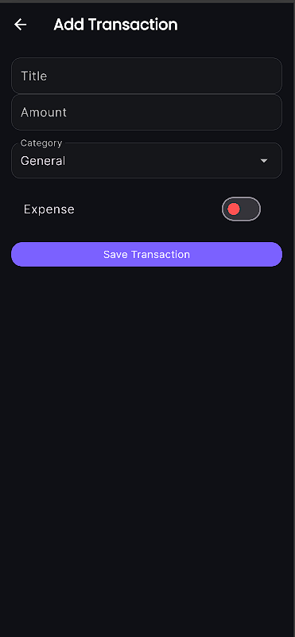
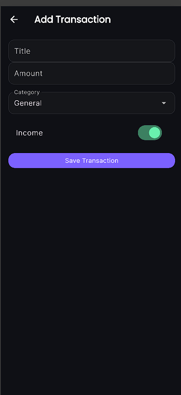
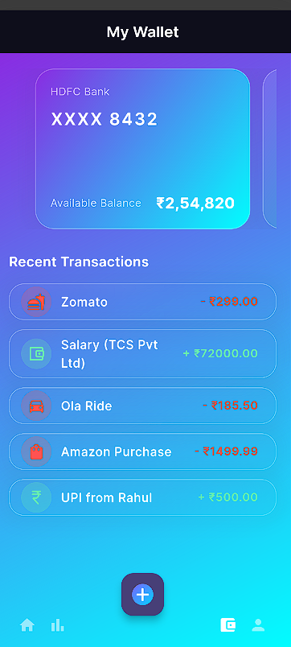
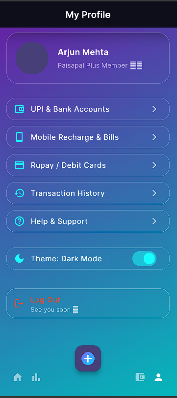

# 💸 Paisa Pal

**Paisa Pal** is an optimized Flutter app for **daily expense tracking and personal finance management**. Track your spending, manage budgets, and make smarter financial decisions! 📊📱💰

---

## 🚀 Features

- **📝 Daily Expense & Income Tracking** – Log every transaction quickly and easily.
- **📊 Category-wise Analysis** – Visualize spending patterns with interactive charts.
- **💰 Budget Management** – Set budgets, track progress, and manage your financial goals.
- **🌎 Multi-Currency Support** – Track finances in multiple currencies.
- **🔒 Secure Storage** – All data is stored locally and safely using **Hive**, a lightweight and fast key-value database for Flutter.
- **🗓 Flexible Date Filters** – View your finances by day, week, month, quarter, or year.

---

## 🖼 Screenshots

All screenshots are stored in `lib/assets/`:

| Home Screen | Add Debit | Add Credit |
|-------------|-----------|------------|
|  |  |  |

| Wallet | Profile |
|--------|---------|
|  |  |

---

## 🛠️ Getting Started

This project is a starting point for a Flutter application.  

Clone the repository:

```bash
git clone https://github.com/prakhaaar/paisa_pal.git

```

Install dependencies:

```bash

flutter pub get

```
Run the app:

```bash

flutter run

```
**Make sure your device/emulator is connected before running the app.**

**Useful Resources**
Lab: Write your first Flutter app

Cookbook: Useful Flutter samples

Flutter Documentation

⚡ Technical Details
**Local Storage:** Uses Hive to store transactions, wallets, and budgets locally for fast access and offline functionality.

**State Management:** Uses Provider for reactive UI updates and efficient state management.

**Charts & Analytics:** Integrated with fl_chart for visualizing spending and income trends.

**Responsive UI:** Works on both mobile phones and tablets with adaptive layouts.

📂 Folder Structure

bash

lib/
 ├─ assets/          # Screenshots and images
 ├─ models/          # Hive models for transactions and wallets
 ├─ providers/       # Provider state management
 ├─ screens/         # UI screens (Home, Add Debit, Add Credit, Wallet, Profile)
 └─ main.dart        # Entry point

```
**
💡 Notes

All transactions are offline-first, so your data is safe even without internet.

Hive ensures fast, local storage for smooth performance.
**
Flexible filtering options help analyze spending by day, week, month, or year.

**Made with ❤️ using Flutter**
